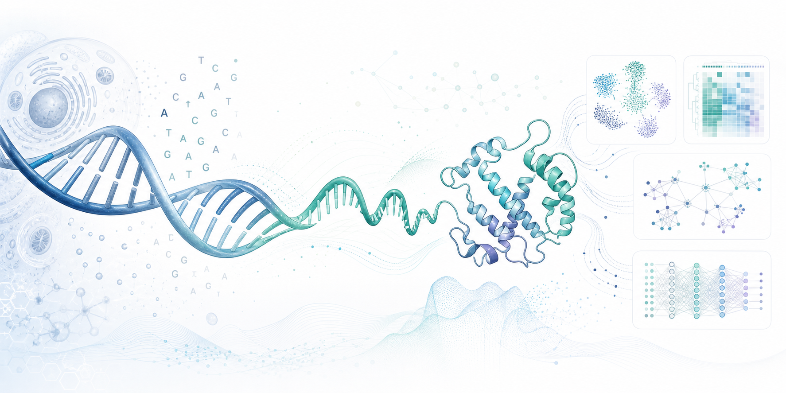

# Awesome AI/MLLM for Central Dogma Multi-Omics

[](https://awesome.re)
[](https://arxiv.org/abs/2412.12668)
[](LICENSE)
[](papers/)

A living survey of AI/MLLM methods for central dogma-centric multi-omics: DNA, RNA, protein, cells, phenotype, and the models that connect them.



This repository is organized around the review [Artificial Intelligence for Central Dogma-Centric Multi-Omics: Challenges and Breakthroughs](https://arxiv.org/abs/2412.12668), then expanded with related and newer AI/MLLM work. It follows an awesome-list style so readers can quickly find papers, models, code, datasets, and benchmark directions.

## Contents

- [📢 News](#news)
- [🧭 Why This Repository](#why-this-repository)
- [🗂 Paper Collection](#paper-collection)
- [✨ Recent Highlights](#recent-highlights)
- [🤖 Foundation Models](#foundation-models)
- [🧪 Datasets and Benchmarks](#datasets-and-benchmarks)
- [⚠️ Challenges](#challenges)
- [🗺 Reading Path](#reading-path)
- [🧩 Repository Map](#repository-map)
- [✍️ Contributing](#contributing)
- [📚 Citation](#citation)

## 📢 News

- 2026-05-04: Reworked the repository into an awesome-style AI/MLLM survey with a polished README cover image.
- 2026-05-04: Added task pages, a fusion/integration page, a survey page, and a year-organized paper index.
- 2026-05-04: Expanded foundation models, datasets, benchmarks, and reproducibility checklists.
- 2026-05-04: Added newer single-cell, spatial, and multi-omics papers from 2025-2026.

## 🧭 Why This Repository

Most multi-omics lists group methods by assay or disease. This repository keeps the central dogma view explicit and gives AI/MLLM methods the front seat:

```text
DNA / genome -> RNA / transcriptome -> protein / proteome -> phenotype
```

That framing makes it easier to ask whether an AI/MLLM system merely concatenates modalities or actually learns biologically meaningful cross-layer relationships.

## 🗂 Paper Collection

The paper list is organized in two ways: by task for method lookup, and by year for survey-style reading.

| Category | What it covers | Entry |
| --- | --- | --- |
| Year index | Chronological list from classical integration to recent foundation models | [papers/by-year.md](papers/by-year.md) |
| Classification | Cancer subtype, disease state, cell type, and phenotype classification | [papers/classification.md](papers/classification.md) |
| Regression | Drug response, expression prediction, binding energy, and survival-risk modeling | [papers/regression.md](papers/regression.md) |
| Generation | Synthetic omics, cross-modal generation, imputation, simulation, and histology translation | [papers/generation.md](papers/generation.md) |
| Clustering | Patient grouping, subtype discovery, cell heterogeneity, and dimensionality reduction | [papers/clustering.md](papers/clustering.md) |
| Fusion and integration | Alignment, shared latent spaces, graph fusion, and cross-modal embedding | [papers/fusion-and-integration.md](papers/fusion-and-integration.md) |
| Surveys | Review papers and high-level maps of the field | [papers/surveys.md](papers/surveys.md) |

## ✨ Recent Highlights

| Year | Paper | Why it matters |
| --- | --- | --- |
| 2025 | [scMultiSim](https://www.nature.com/articles/s41592-025-02651-0) | Simulation benchmark for single-cell multi-omics and spatial data. |
| 2025 | [SIMO](https://www.nature.com/articles/s41467-025-56523-4) | Spatial integration of multi-omics single-cell data. |
| 2025 | [scTFBridge](https://www.nature.com/articles/s41467-025-64227-y) | TF-motif-informed gene regulation inference in single-cell multi-omics. |
| 2025 | [HALO](https://www.nature.com/articles/s41467-025-63921-1) | Causal modeling for coupled and decoupled single-cell modalities. |
| 2025 | [scKGBERT](https://genomebiology.biomedcentral.com/articles/10.1186/s13059-025-03862-6) | Knowledge-enhanced foundation model for single-cell transcriptomics. |
| 2025 | [Multitask benchmarking](https://www.nature.com/articles/s41592-025-02856-3) | Large benchmark of single-cell multimodal integration methods. |
| 2025 | [Nicheformer](https://www.nature.com/articles/s41592-025-02814-z) | Foundation model for single-cell and spatial omics. |
| 2025 | [Novae](https://www.nature.com/articles/s41592-025-02899-6) | Graph-based foundation model for spatial transcriptomics. |
| 2025 | [EpiAgent](https://www.nature.com/articles/s41592-025-02822-z) | Foundation model for single-cell epigenomics. |
| 2026 | [Evo 2](https://www.nature.com/articles/s41586-026-10176-5) | Genome-scale biomolecular foundation model across all domains of life. |

## 🤖 Foundation Models

The foundation-model page is split into cross-omics sequence models and single-cell/spatial AI models.

| Thread | Representative models | Entry |
| --- | --- | --- |
| Cross-omics and central-dogma sequence models | Evo, Evo 2, LucaOne, CD-GPT, Life-Code, OmniBioTE, DNABERT-2, HyenaDNA, Caduceus | [models/foundation-models.md](models/foundation-models.md) |
| Single-cell and spatial foundation models | Geneformer, scGPT, scFoundation, GeneCompass, UCE, CellFM, scKGBERT, Nicheformer, Novae, EpiAgent, scvi-hub | [models/foundation-models.md](models/foundation-models.md) |

## 🧪 Datasets and Benchmarks

| Resource type | Examples | Entry |
| --- | --- | --- |
| Cancer multi-omics | TCGA/GDC, CPTAC/PDC, CCLE/DepMap, GDSC | [resources/datasets-and-benchmarks.md](resources/datasets-and-benchmarks.md) |
| Single-cell and spatial omics | Human Cell Atlas, CZ CELLxGENE Census, 10x Multiome, HuBMAP | [resources/datasets-and-benchmarks.md](resources/datasets-and-benchmarks.md) |
| Sequence and expression corpora | GenBank, UniRef100, ARCHS4, GTEx, LINCS L1000 | [resources/datasets-and-benchmarks.md](resources/datasets-and-benchmarks.md) |
| Evaluation checklists | Modality coverage, pairing, split design, batch effects, biological validation | [resources/datasets-and-benchmarks.md](resources/datasets-and-benchmarks.md) |

## ⚠️ Challenges

The review repeatedly highlights data sparsity, missing modalities, batch effects, weak interpretability, long-sequence cost, privacy, and benchmark fragmentation. See [resources/challenges.md](resources/challenges.md) for a paper-review checklist and open problems worth tracking.

## 🗺 Reading Path

1. Read the source review: [arXiv:2412.12668](https://arxiv.org/abs/2412.12668).
2. Use [papers/surveys.md](papers/surveys.md) to understand the broader field.
3. Scan [papers/by-year.md](papers/by-year.md) for the timeline of methods.
4. Read [papers/fusion-and-integration.md](papers/fusion-and-integration.md) for the main model-design backbone.
5. Drill into task pages: [classification](papers/classification.md), [regression](papers/regression.md), [generation](papers/generation.md), and [clustering](papers/clustering.md).
6. Check [models/foundation-models.md](models/foundation-models.md) for newer central-dogma and single-cell foundation models.
7. Use [resources/datasets-and-benchmarks.md](resources/datasets-and-benchmarks.md) before reproducing or comparing methods.

## 🧩 Repository Map

```text
awesome-ai-mllm-for-central-dogma-multiomics/
+-- README.md
+-- CONTRIBUTING.md
+-- CITATION.cff
+-- LICENSE
+-- assets/
|   `-- central-dogma-multiomics-cover.png
+-- papers/
|   +-- README.md
|   +-- by-year.md
|   +-- classification.md
|   +-- regression.md
|   +-- generation.md
|   +-- clustering.md
|   +-- fusion-and-integration.md
|   `-- surveys.md
+-- models/
|   `-- foundation-models.md
+-- resources/
|   +-- challenges.md
|   `-- datasets-and-benchmarks.md
`-- docs/
    `-- repo-roadmap.md
```

## ✍️ Contributing

Contributions are welcome. Please see [CONTRIBUTING.md](CONTRIBUTING.md) for paper-entry format, preferred links, and style rules.

Good additions include:

- New papers with primary links.
- Official code or checkpoint links.
- Dataset portals and benchmark metadata.
- Corrections to venue, year, modality, task, or method-family labels.
- Reproducible evaluation protocols.

## 📚 Citation

If this repository helps your work, please cite the source review:

```bibtex
@article{xin2024ai,
  title   = {Artificial Intelligence for Central Dogma-Centric Multi-Omics: Challenges and Breakthroughs},
  author  = {Lei Xin and Caiyun Huang and Hao Li and Shihong Huang and others},
  journal = {arXiv preprint arXiv:2412.12668},
  year    = {2024},
  url     = {https://arxiv.org/abs/2412.12668}
}
```
